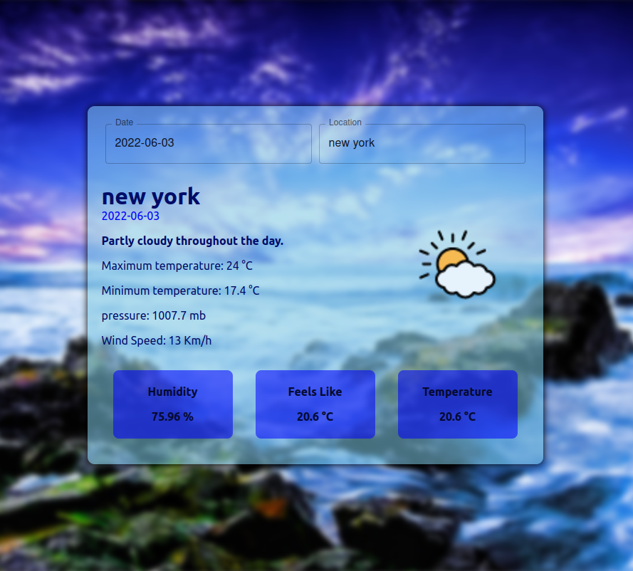

<div id="top"></div>

<!-- PROJECT SHIELDS -->
<!--
*** I'm using markdown "reference style" links for readability.
*** Reference links are enclosed in brackets [ ] instead of parentheses ( ).
*** See the bottom of this document for the declaration of the reference variables
*** for contributors-url, forks-url, etc. This is an optional, concise syntax you may use.
*** https://www.markdownguide.org/basic-syntax/#reference-style-links
-->
[![Contributors][contributors-shield]][contributors-url]
[![Forks][forks-shield]][forks-url]
[![Stargazers][stars-shield]][stars-url]
[![Issues][issues-shield]][issues-url]
[![MIT License][license-shield]][license-url]
[![LinkedIn][linkedin-shield]][linkedin-url]


<!-- PROJECT LOGO -->
<br />
<div align="center">
<!--   <a href="https://github.com/othneildrew/Best-README-Template">
    
  </a> -->

  <h3 align="center">Weather Web App</h3>

  <p align="center">
      A weather web app connected to [Visual Crossing](https://www.visualcrossing.com/) API
    <br />
    <a href="https://github.com/alireza-jahandoost/weather-web-app"><strong>Explore the docs »</strong></a>
    <br />
    <br />
    <a href="https://weather-web-app-kohl.vercel.app/">View Website</a>
    ·
    <a href="https://github.com/alireza-jahandoost/weather-web-app/issues">Report Bug</a>
    ·
    <a href="https://github.com/alireza-jahandoost/weather-web-app/issues">Request Feature</a>
  </p>
</div>


<!-- TABLE OF CONTENTS -->
<details>
  <summary>Table of Contents</summary>
  <ol>
    <li>
      <a href="#about-the-project">About The Project</a>
      <ul>
        <li><a href="#built-with">Built With</a></li>
      </ul>
    </li>
    <li>
      <a href="#getting-started">Getting Started</a>
      <ul>
        <li><a href="#prerequisites">Prerequisites</a></li>
        <li><a href="#installation">Installation</a></li>
      </ul>
    </li>
    <li><a href="#usage">Usage</a></li>
    <li><a href="#roadmap">Roadmap</a></li>
    <li><a href="#contributing">Contributing</a></li>
    <li><a href="#license">License</a></li>
    <li><a href="#contact">Contact</a></li>
    <li><a href="#acknowledgments">Acknowledgments</a></li>
  </ol>
</details>


<!-- ABOUT THE PROJECT -->
## About The Project

<div align="center">
  <a href="https://weather-web-app-kohl.vercel.app">
    
  </a>
</div>

This is a practical project, to get involved with redux, and how it can be tested by jest js

The features that are currently supported:
* Get weather information of a specific place in a specific time

<p align="right">(<a href="#top">back to top</a>)</p>


### Built With

* [React.js](https://reactjs.org/)
* [Laravel](https://laravel.com)
* [MUI](https://mui.com)
* [Redux](https://redux.js.org/)
* [Styled Components](https://styled-components.com/)

<p align="right">(<a href="#top">back to top</a>)</p>


<!-- GETTING STARTED -->
## Getting Started

### Prerequisites

To run this project in your pc, you need:
* nodejs and npm
* an api key from [Visual Crossing](https://www.visualcrossing.com)

### Installation

1. Clone the repo
   ```sh
   git clone https://github.com/alireza-jahandoost/weather-web-app
   ```
2. Move to the directory
   ```sh
   cd weather-web-app
   ```
3. Install js dependencies
   ```sh
   npm install
   ```
4. Create `/src/api/key.js` file with your api key
   ```sh
   echo "export const KEY = 'Type Your Api Key Here';" >> src/api/key.js
   ```

<p align="right">(<a href="#top">back to top</a>)</p>


<!-- USAGE EXAMPLES -->
## Usage

To run the project, you need to start it:
   ```sh
   npm start
   ```
Then, you can access the web app from `http://localhost:3000`

<p align="right">(<a href="#top">back to top</a>)</p>

<!-- CONTRIBUTING -->
## Contributing

Contributions are what make the open source community such an amazing place to learn, inspire, and create. Any contributions you make are **greatly appreciated**.

If you have a suggestion that would make this better, please fork the repo and create a pull request. You can also simply open an issue with the tag "enhancement".
Don't forget to give the project a star! Thanks again!

1. Fork the Project
2. Create your Feature Branch (`git checkout -b feature/AmazingFeature`)
3. Commit your Changes (`git commit -m 'Add some AmazingFeature'`)
4. Push to the Branch (`git push origin feature/AmazingFeature`)
5. Open a Pull Request

<p align="right">(<a href="#top">back to top</a>)</p>


<!-- LICENSE -->
## License

Distributed under the MIT License. See `LICENSE` for more information.

<p align="right">(<a href="#top">back to top</a>)</p>


<!-- CONTACT -->
## Contact

Alireza Jahandoost - alireza.jhd2000@gmail.com

Project Link: [https://github.com/alireza-jahandoost/weather-web-app](https://github.com/alireza-jahandoost/weather-web-app)

<p align="right">(<a href="#top">back to top</a>)</p>

<!-- MARKDOWN LINKS & IMAGES -->
<!-- https://www.markdownguide.org/basic-syntax/#reference-style-links -->
[contributors-shield]: https://img.shields.io/github/contributors/alireza-jahandoost/weather-web-app.svg?style=for-the-badge
[contributors-url]: https://github.com/alireza-jahandoost/weather-web-app/graphs/contributors
[forks-shield]: https://img.shields.io/github/forks/alireza-jahandoost/weather-web-app.svg?style=for-the-badge
[forks-url]: https://github.com/alireza-jahandoost/weather-web-app/network/members
[stars-shield]: https://img.shields.io/github/stars/alireza-jahandoost/weather-web-app?style=for-the-badge
[stars-url]: https://github.com/alireza-jahandoost/weather-web-app/stargazers
[issues-shield]: https://img.shields.io/github/issues/alireza-jahandoost/weather-web-app.svg?style=for-the-badge
[issues-url]: https://github.com/alireza-jahandoost/weather-web-app/issues
[license-shield]: https://img.shields.io/github/license/alireza-jahandoost/weather-web-app.svg?style=for-the-badge
[license-url]: https://github.com/alireza-jahandoost/weather-web-app/blob/master/LICENSE
[linkedin-shield]: https://img.shields.io/badge/-LinkedIn-black.svg?style=for-the-badge&logo=linkedin&colorB=555
[linkedin-url]: https://www.linkedin.com/in/alireza-jahandoost
[product-screenshot]: images/screenshot.png
